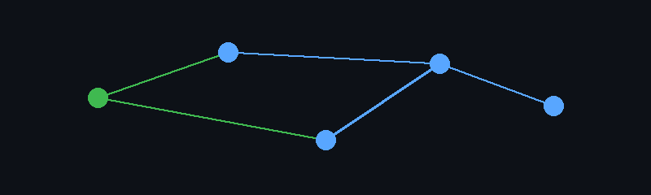

  

# Projetos e materiais educacionais — Pós Full Stack Club

Este perfil reúne projetos desenvolvidos no contexto da Pós Full Stack Club e materiais educacionais de apoio.

## Atividade recente

Mantido por [Fabiano Góes](https://github.com/fabianogoes), professor do curso. Para projetos e atuação profissional, acesse o perfil principal.

## Referências profissionais

  
  
  
  
  

